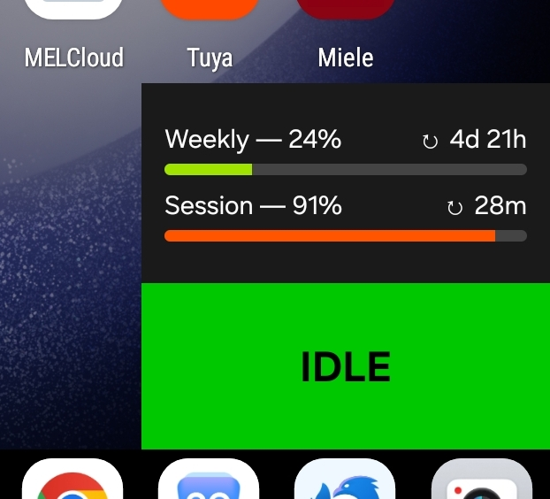
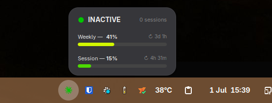

# codelight — Claude Code status display

Live Claude Code dashboard built with four components. Pick and choose whatever suits your needs:

| Component | Description | Example
|---|---|---|
| [**companion/**](companion/README.md) | Python daemon that polls Claude Code usage and pushes it over WebSocket|
| [**screen/**](screen/README.md) | ESP8266 firmware for the GeekMagic Ultra — renders usage bars and status |  |
| [**android/**](android/README.md) | Android home-screen widget showing the same data via WebSocket |  |
| [**gnome-extension/**](gnome-extension/README.md) | GNOME Shell status-bar extension | |

The different UI variants shows basically the same information.
<table border="1" padding="3"><tr>
<td align="center"></td>
<td align="center"></td>
<td align="center"></td>
<tr><td>Claude Code working</td><td>Waiting for user input</td><td>Ready for a new task</td> 
</tr></table>


## Architecture

```
Claude Code               codelight.py (daemon)
───────────────           ─────────────────────
                          Unix socket thread
hooks fire on  ────────►  receives event         broadcast
tool use /      --hook    updates state          ────────►  GeekMagic Ultra (WebSocket)
messages        mode                             ────────►  Android widget  (WebSocket)
                                                 ────────►  GNOME extension (D-Bus signal)
                          Usage poller thread
                          fetches claude.ai API   push on
                          every 60 s              each poll

                          WebSocket server (:8765)
                          clients connect in ◄───  screen discovers companion via mDNS
                                             ◄───  Android discovers companion via mDNS

                          D-Bus service (session bus)
                          se.henrikekblad.codelight ◄─── GNOME extension auto-discovers
```

The ESP8266 screen and Android widget use WebSocket (discovered via mDNS). The GNOME
extension uses D-Bus on the session bus — no network socket or configuration needed.

## Quick start

1. Flash the screen firmware (or grab a pre-built `.bin` from the
   [Releases page](https://github.com/henrikekblad/codelight/releases)):
   see [screen/README.md](screen/README.md).

2. Run the companion daemon on your computer:
   ```bash
   python3 companion/codelight.py --name my-laptop
   ```
   Full setup: [companion/README.md](companion/README.md).

3. *(Optional)* Install the Android widget: [android/README.md](android/README.md).

4. *(Optional)* Install the GNOME extension: [gnome-extension/README.md](gnome-extension/README.md).
