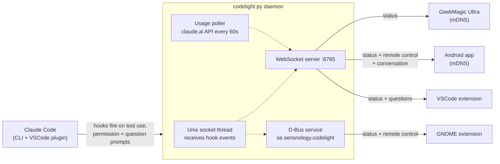

# codelight — Claude Code status & remote control

Live Claude Code status **and a remote-control surface**, built from five
components. Watch usage and working/waiting status on a desk screen, phone,
GNOME panel, or in VSCode — and, when you're away from the keyboard, **approve
permission prompts and answer Claude's questions** from any of them. Pick and
choose whatever suits your needs:

| Component | Description | Example
|---|---|---|
| [**companion/**](companion/README.md) | Python daemon that polls Claude Code usage, tracks status, and pushes it over WebSocket + D-Bus — and brokers remote control |
| [**screen/**](screen/README.md) | ESP8266 firmware for the GeekMagic Ultra — renders usage bars and status |  |
| [**android/**](android/README.md) | Android app + home-screen widget: live status, and (with remote control) a Conversation view and Allow/Deny + question answering |  |
| [**gnome-extension/**](gnome-extension/README.md) | GNOME Shell panel extension: status + approve/answer prompts from a popup | |
| [**vscode-extension/**](vscode-extension/README.md) | VSCode status bar + answers Claude's AskUserQuestion prompts in the editor | |

## Remote control

Run the companion with `--remote-control` (requires `--secret`) and codelight
takes over Claude Code's interactive prompts, pushing them to any connected
client so you can respond from wherever you are:

- **Permission prompts** (Allow / Deny) — from the **Android app** or the
  **GNOME panel**.
- **AskUserQuestion** (multiple-choice + free text) — from the **Android app**,
  the **GNOME panel**, or **VSCode** (a themed WebView in the editor).

Whoever answers first wins, and answering Claude Code's own dialog dismisses the
remote prompts. If no client is connected that can answer, codelight falls
through to Claude Code's built-in prompt right away — so you're never left
waiting on a device that isn't there. (In VSCode, permission prompts are left to
Claude Code's native dialog; only AskUserQuestion is answered in-editor.) See
[companion/README.md](companion/README.md#remote-control).

The status UIs all show the same core information:
<table border="1" padding="3"><tr>
<td align="center"></td>
<td align="center"></td>
<td align="center"></td>
<tr><td>Claude Code working</td><td>Waiting for user input</td><td>Ready for a new task</td> 
</tr></table>


## Architecture



The ESP8266 screen and Android app use WebSocket (discovered via mDNS). The
GNOME extension uses D-Bus on the session bus — no network socket or
configuration needed. With `--remote-control`, permission and question prompts
are pushed to the clients that subscribe to them (the screen and older apps
never see them). See
[companion/README.md](companion/README.md#remote-control).

## Quick start

1. Flash the screen firmware (or grab a pre-built `.bin` from the
   [Releases page](https://github.com/henrikekblad/codelight/releases)):
   see [screen/README.md](screen/README.md).

2. Run the companion daemon on your computer:
   ```bash
   python3 companion/codelight.py --name my-laptop
   ```
   Add `--secret mypassword --remote-control` to enable remote approval and
   question answering. Full setup: [companion/README.md](companion/README.md).

3. *(Optional)* Install the Android app: [android/README.md](android/README.md).

4. *(Optional)* Install the GNOME extension: [gnome-extension/README.md](gnome-extension/README.md).

5. *(Optional)* Install the VSCode extension: [vscode-extension/README.md](vscode-extension/README.md).
