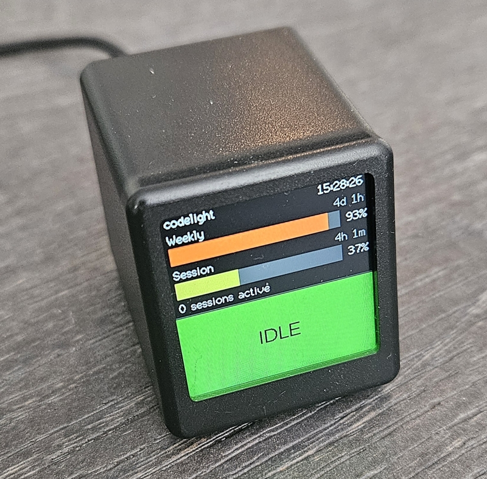
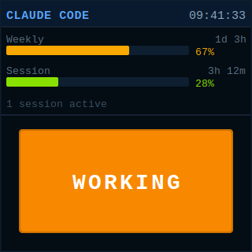
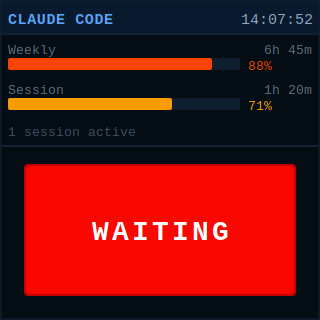
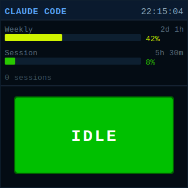
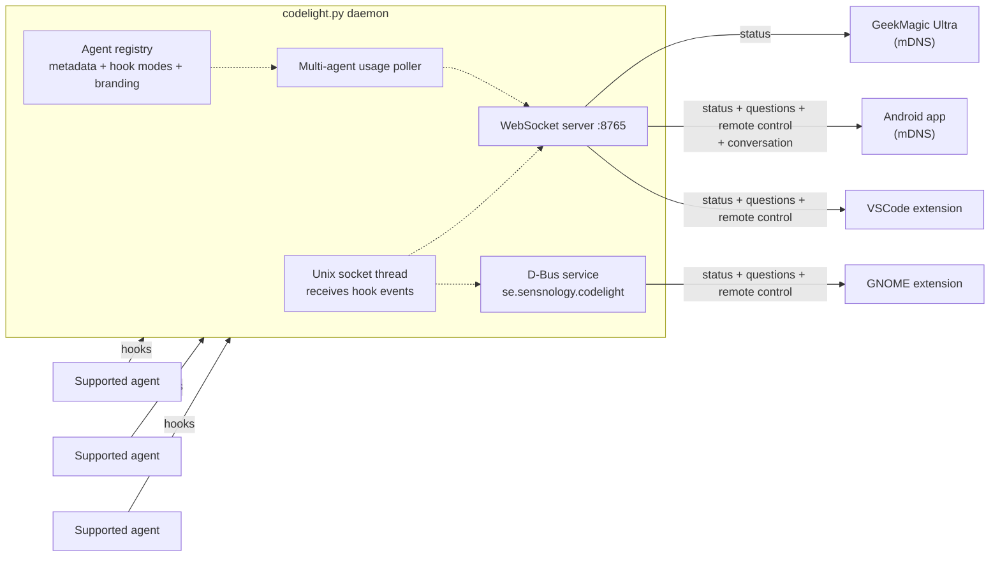
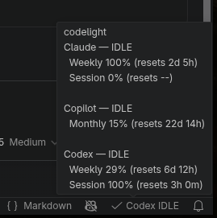
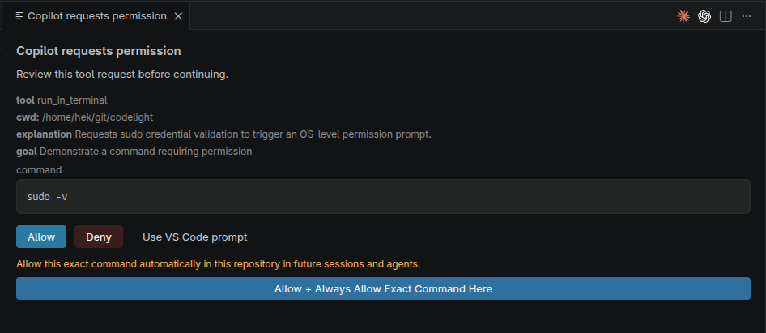

# codelight - coding-agent status & remote control

Live status, usage, conversation following, and **remote-control prompts** for
supported coding agents. Watch grouped working/waiting/idle state on a desk
screen, phone, GNOME panel, or in VSCode — and, when you're away from the
keyboard, **approve permission prompts and answer agent questions** from any of
them. Pick and choose whatever suits your needs:

## Currently supported agents

| Agent | Status | Usage | Remote control | Conversation |
|---|---|---|---|---|
| Claude Code | ✅ | ✅ | Permissions + questions | ✅ |
| Codex CLI / IDE extension | ✅ | ✅ | Permissions + questions | ✅ |
| GitHub Copilot / Copilot Chat | ✅ | Optional org monthly pool | Permissions; questions where exposed by the IDE hook path | ✅ |

Agent-specific setup, caveats, and config keys live in
[companion/AGENTS.md](companion/AGENTS.md). New integrations are discovered from
the companion's agent modules and clients render the metadata they receive.

| Component | Description | Example
|---|---|---|
| [**companion/**](companion/README.md) | Python daemon that detects supported agents, installs their hooks, polls usage where available, pushes status over WebSocket + D-Bus, and brokers remote control. Agent config and quirks: [companion/AGENTS.md](companion/AGENTS.md). |
| [**screen/**](screen/README.md) | ESP8266 firmware for the GeekMagic Ultra — renders usage bars and status |  |
| [**android/**](android/README.md) | Responsive Android widget + Status and Conversation views, permission review, and question answering |  |
| [**gnome-extension/**](gnome-extension/README.md) | GNOME Shell panel extension: status + approve/answer prompts from a popup | |
| [**vscode-extension/**](vscode-extension/README.md) | VSCode status bar + answers supported agent questions in the editor | |

## Remote control

Run the companion with `--remote-control` (requires `--secret`) and codelight
takes over supported interactive prompts, pushing them to any connected
client so you can respond from wherever you are:

- **Permission prompts** (Allow / Deny) — from the **Android app** or the
  **GNOME panel**.
- **Questions** (multiple-choice + free text) - from the **Android app**,
  the **GNOME panel**, or **VSCode** (a themed WebView in the editor).

Whoever answers first wins. If no capable client is connected, codelight falls
through to the agent's built-in prompt. See
[companion/README.md](companion/README.md#remote-control); agent-specific
prompt details live in [companion/AGENTS.md](companion/AGENTS.md).

Persistent folder and exact-command approvals are stored once in codelight's
agent-neutral policy and enforced in the shared hook path. See
[Persistent folder and command approvals](companion/README.md#persistent-folder-and-command-approvals).

The status UIs all show the same core information:
<table border="1" padding="3"><tr>
<td align="center"></td>
<td align="center"></td>
<td align="center"></td>
<tr><td>Agent working</td><td>Waiting for user input</td><td>Ready for a new task</td>
</tr></table>


## Architecture



The ESP8266 screen and Android app use WebSocket (discovered via mDNS). The
GNOME extension uses D-Bus on the session bus — no network socket or
configuration needed. With `--remote-control`, permission and question prompts
are pushed to the clients that subscribe to them (the screen and older apps
never see them). See
[companion/README.md](companion/README.md#remote-control).

## Quick start

1. Flash the screen firmware (or grab a pre-built `.bin` from the
   [Releases page](https://github.com/henrikekblad/codelight/releases)):
   see [screen/README.md](screen/README.md).

2. Run the companion daemon on your computer:
   ```bash
   python3 companion/codelight.py --name my-laptop
   ```
   Add `--secret mypassword --remote-control` to enable remote approval and
   question answering. Installed supported agents are detected automatically and
   their hooks are managed together. Full setup:
   [companion/README.md](companion/README.md).

3. *(Optional)* Install the Android app: [android/README.md](android/README.md).

4. *(Optional)* Install the GNOME extension: [gnome-extension/README.md](gnome-extension/README.md).

5. *(Optional)* Install the VSCode extension: [vscode-extension/README.md](vscode-extension/README.md).

## More screenshots

<table>
<tr>
<td></td>
<td></td>
<td></td>
</tr>
<tr>
<td align="center">Adaptive multi-agent widget</td>
<td align="center">Conversation following</td>
<td align="center">Permission review</td>
</tr>
</table>

<table>
<tr>
<td></td>
<td></td>
<td></td>
</tr>
<tr>
<td align="center">VS Code status</td>
<td align="center">VS Code permission review</td>
<td align="center">Companion dashboard</td>
</tr>
</table>
