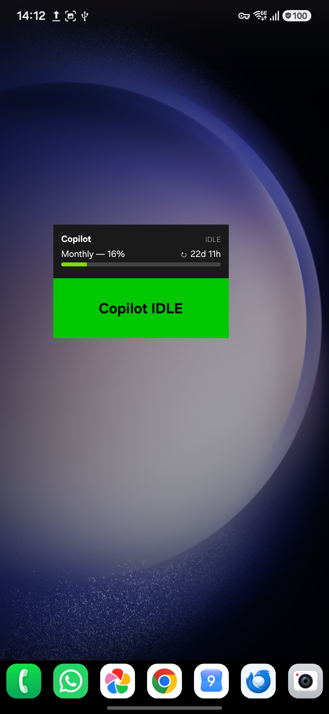
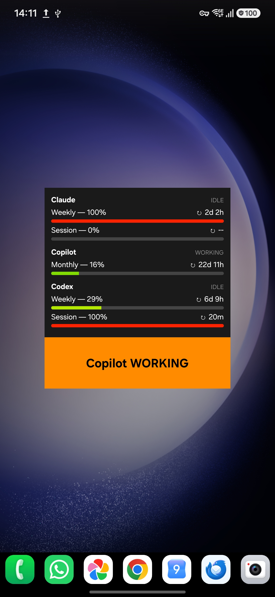
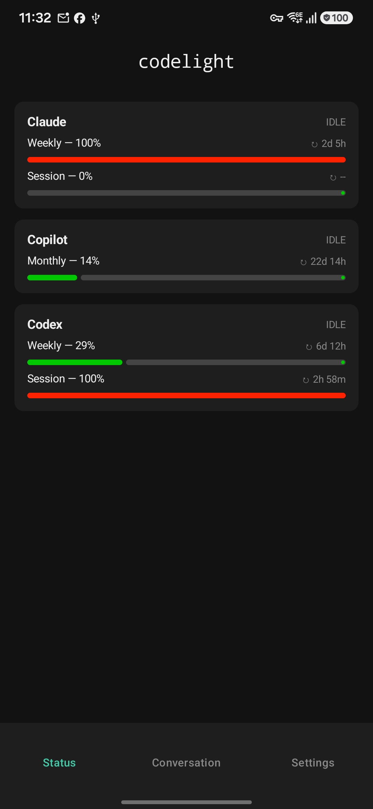
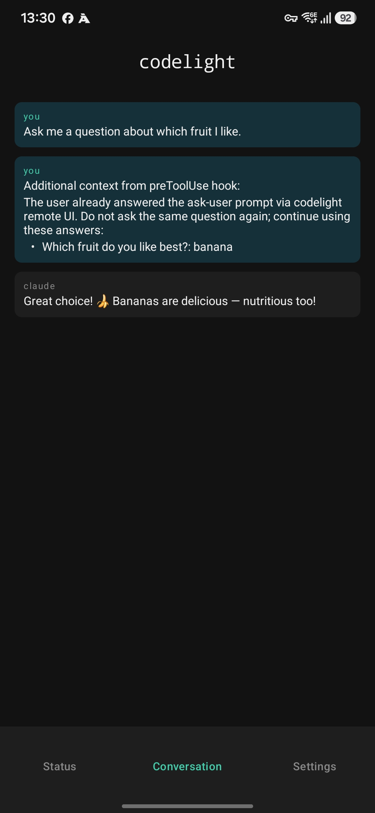
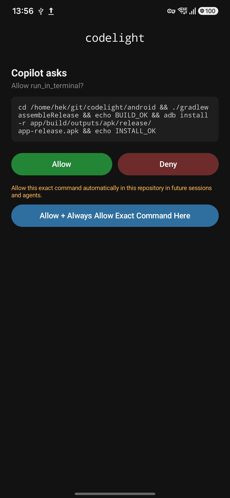

# codelight — Android app

A home-screen widget and app that show grouped Claude, Copilot, and Codex status
and available usage limits, updated instantly via WebSocket. The widget adapts
to its size: compact layouts show the latest agent, while taller or wider
layouts show more agent groups. When the companion
runs with `--remote-control`, the app also becomes a small **control surface**:
approve permission prompts, answer agent questions, and follow the live
conversation — all from your phone.

<table>
<tr>
<td></td>
<td></td>
<td></td>
</tr>
<tr>
<td align="center">Compact widget</td>
<td align="center">Expanded widget</td>
<td align="center">Status tab</td>
</tr>
</table>

## Setup

1. Install the optional Python dependencies on your computer (see
   [companion/README.md](../companion/README.md)):
   ```bash
   pip install websockets zeroconf
   ```

2. Start the companion daemon with `--secret` (recommended):
   ```bash
   python3 companion/codelight.py --secret mypassword
   ```

3. Build and install the Android app:
   - Open the `android/` directory as a project in Android Studio, or
   - Sideload the APK from the [Releases page](https://github.com/henrikekblad/codelight/releases).

4. Add the **codelight** widget to your home screen.

5. Open the **codelight** app (or tap the widget) and enter the password.
   Leave it blank if you did not set `--secret`.

The widget connects automatically and stays updated in the background.

## Remote control

The app uses a bottom tab bar:

- **Status** — grouped agent state and every usage window exposed by the
  companion, including optional company Copilot monthly credits.
- **Conversation** — the last N lines of the active session (configurable),
  with tool calls and output from Claude, Copilot, or Codex; read-only.
- **Request** — appears when an agent is waiting on you: **Allow / Deny** for a
  permission, or the options + an "Other…" free-text field for an
  AskUserQuestion. Whoever answers first (phone, GNOME, or VSCode) wins.
- **Settings** — everything below.

A request also raises a notification; tapping it opens the Request tab. Enable
**Auto-open on request** (Settings) to have the app pop open by itself when a
prompt arrives — this needs the "draw over other apps" permission, which the
app will prompt for. Toggle **Permission prompts** / **Question prompts** to
choose which kinds you want to handle on the phone.

Permission requests can also trust a repository for narrowly safe edits or
persist the exact requested command for that repository. These choices are
shared across agents; see the companion's
[permission policy](../companion/README.md#persistent-folder-and-command-approvals).

Without `--remote-control`, Status, Settings, and the widget remain available;
Conversation and Request require the companion features that feed them.

<table>
<tr>
<td></td>
<td></td>
</tr>
<tr><td align="center">Conversation following</td><td align="center">Permission review</td></tr>
</table>

## Hiding the persistent notification

The app runs as a foreground service, which Android requires to show a
persistent notification. To hide it from the status bar without stopping
the service:

1. Long-press the notification in the drawer and tap the cog icon.
2. Tap **Notification categories** → **codelight service**.
3. Select **Minimize notification**.

The service keeps running; only the status bar icon disappears.

## How it discovers the daemon

The daemon advertises itself on the local network via mDNS (`_codelight._tcp`).
The Android app uses `NsdManager` to find it automatically — no IP address
configuration required. On reconnect after a network change it rediscovers the
daemon via mDNS.

## Manual host override

If mDNS doesn't work on your network, open the codelight app, enter the
daemon's IP address and port (default 8765), and save. The app skips
discovery and connects directly.

## Samsung battery optimization

Samsung's "App sleeping" can kill the background service. To prevent this:

1. Long-press the app icon and tap the **i** (App Info) button.
2. Tap **Battery**.
3. Change from **Optimized** to **Unrestricted**.

## Firewall

The app connects to port 8765 (TCP) and uses mDNS on port 5353 (UDP) for
discovery. See [companion/README.md](../companion/README.md#firewall) for
firewall configuration.
