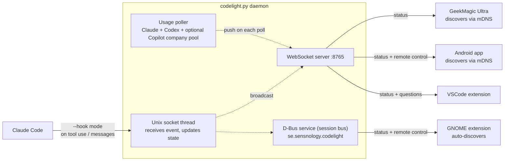

# codelight companion

The Python daemon `codelight.py` runs on your computer and pushes coding-agent
status to all connected clients — the GeekMagic Ultra screen, Android app,
GNOME extension, and VSCode extension. Claude Code is enabled automatically;
GitHub Copilot and Codex hooks are optional. With `--remote-control` it also
brokers supported interactive prompts to those clients so you can approve
permissions and answer questions remotely (see [Remote control](#remote-control)).

When run in a terminal it shows a live dashboard. When run as a systemd service
it is silent (key events are logged to the journal via stdout).

## Dependencies

**Arch Linux**
```bash
sudo pacman -S python-websockets python-zeroconf python-dbus-fast  # python-dbus-fast optional: GNOME extension
```

**Debian / Ubuntu**
```bash
pip install websockets zeroconf dbus-fast  # dbus-fast optional: GNOME extension
```

`websockets` and `zeroconf` are required. `dbus-fast` is optional — install it
to enable the D-Bus service that the GNOME extension subscribes to.

## Run

```bash
python3 companion/codelight.py --name my-laptop
```

`--name` is required. It is the mDNS service instance name clients use to find
this daemon on the network. Use something unique per machine (e.g.
`henrik-laptop`, `alice-workstation`).

**With a shared secret** (recommended on shared networks):
```bash
python3 companion/codelight.py --name my-laptop --secret mypassword
```

Set the same secret in the screen's config page and in the Android app.
The GNOME extension uses D-Bus (session bus) and does not need a secret.

On startup the script detects supported agents from installed CLIs and VSCode
extensions, then manages hooks for all detected agents:

- Claude Code CLI or `anthropic.claude-code`
- GitHub Copilot CLI or `github.copilot` / `github.copilot-chat`
- Codex CLI or `openai.chatgpt`

Claude hooks are merged into `~/.claude/settings.json`, Copilot hooks are written
to the codelight-owned `~/.copilot/hooks/codelight.json`, and Codex hooks are
merged into `~/.codex/hooks.json`. Codex CLI and the local Codex IDE extension
share this configuration.

Codex requires non-managed command hooks to be reviewed by hash. After the
initial install—or whenever Codex says a new/changed hook needs review—open
Codex CLI and run `/hooks`, inspect the codelight commands, and trust them. This
cannot safely be persisted by the Python installer. Codex offers
`--dangerously-bypass-hook-trust` for a single
already-vetted automation launch, but codelight deliberately does not make it a
permanent bypass. See the official
[Codex hooks documentation](https://developers.openai.com/codex/hooks).

Use `--verbose` (`-v`) to add low-level debug events (per-hook socket events,
raw API responses) to the activity log.

### Company Copilot usage

To show the organization's pooled monthly Copilot AI-credit limit in supported
clients, configure its GitHub slug:

```bash
python3 companion/codelight.py --name my-laptop --github-org Drivec-AB
```

The companion calls GitHub's REST API directly; the `gh` command is not
required. Credentials are resolved in this order:

1. `CODELIGHT_GITHUB_TOKEN`, `GITHUB_TOKEN`, or `GH_TOKEN`
2. `--github-token-file PATH`
3. The existing `gh auth token`, when the CLI happens to be installed

The token needs read access to Copilot subscription and organization billing
usage. If the organization or token does not expose detailed billing, clients
simply show Copilot's activity status without a usage bar.

## Run as a systemd user service

The `--install` flag writes the unit file and enables the service in one step:

```bash
python3 companion/codelight.py --install --name my-laptop
python3 companion/codelight.py --install --name my-laptop --secret mypassword
python3 companion/codelight.py --install --name my-laptop \
  --secret mypassword --remote-control --github-org Drivec-AB
```

No per-agent install flags are needed. The detected agent set is stored in the
service command so each daemon restart keeps those hooks current.

```bash
systemctl --user status codelight   # verify it's running
```

The service is scoped to your graphical session — it starts automatically when you log into GNOME and stops cleanly on logout, which ensures it always connects to the correct D-Bus session bus.

Useful commands:

```bash
journalctl --user -fu codelight     # live logs
systemctl --user restart codelight  # restart after config change
systemctl --user disable --now codelight  # disable
```

## Remote control

With `--remote-control` the companion takes over supported interactive prompts
and pushes them to connected clients, where whoever answers first decides. Two
kinds of prompt are handled:

- **Permission prompts** (Allow / Deny / persistent policy choices) — answer
  from the **Android app**, **GNOME extension**, or **VSCode**.
- **Agent questions** (multiple-choice + free-text) — answer
  from the **Android app**, the **GNOME extension**, or **VSCode** (a themed
  WebView in the editor).

Works across supported Claude, Copilot, and Codex hooks. Whoever answers first
wins; a local fallback remains available when the native agent prompt is
preferred.

Local Codex CLI and Codex IDE extension sessions also report status and forward
permission requests when Codex is detected. Codex's question tool is named
`request_user_input`; it is available in Plan Mode by default, or in Default
Mode when this Codex feature is enabled:

```toml
[features]
default_mode_request_user_input = true
```

Codex lifecycle hooks cannot submit a native `request_user_input` response.
Codelight therefore uses an experimental fallback: it blocks the local question
tool after a remote answer and injects the answer into model context. If no
question-capable client is connected or the request times out, codelight emits
no hook decision and Codex shows its normal local question UI.

```bash
python3 companion/codelight.py --install --name my-laptop \
    --secret mypassword --remote-control --vscode
```

- `--remote-control` **requires `--secret`** — answering a prompt is
  code-execution capability and must not be open to anyone on the LAN. Only
  authenticated clients that explicitly subscribe receive the prompts.
- `--vscode` (with `--install`) installs the codelight VSCode extension — from a
  locally built `.vsix` if you have a repo checkout, otherwise downloaded from
  the latest GitHub release — and writes `codelight.secret` into your VSCode
  user settings automatically. VSCode picks the setting up live: no restart
  needed. `--uninstall` removes the extension and its settings again.
- If no client that can answer is connected, the prompt falls through to Claude
  Code's built-in dialog **immediately** — you're never stuck waiting on a
  device that isn't there. A briefly reconnecting client (e.g. VSCode
  restarting) is not mistaken for "nobody home". Otherwise, if nobody answers
  within `--permission-timeout` seconds (default 60), it also falls back.
  Answering the built-in dialog dismisses the remote prompts.
- Toggle prompts per client: the Android app's *Permission prompts* /
  *Question prompts* checkboxes, the GNOME extension's preferences switches, and
  the VSCode `codelight.questionPrompts` setting (all default on).

Under the hood Claude Code uses `PermissionRequest` and a `PreToolUse` hook
matching `AskUserQuestion`. Codex uses `PermissionRequest` and a `PreToolUse`
hook matching `request_user_input`. Normal auto-allowed tool calls are
unaffected.

### Persistent folder and command approvals

A permission prompt can be approved once, or persisted in two deliberately
narrow forms:

- **Allow + Trust Folder for Safe Edits** trusts the repository root for
  read-only workspace tools and `apply_patch` additions/updates whose targets
  stay inside that root. Deletes and arbitrary shell commands still prompt.
- **Allow + Always Allow Exact Command Here** stores the complete command
  literally and only auto-allows that exact string inside the same repository.
  There are no prefixes, globs, regexes, or shell rewriting.

These rules apply consistently to Claude, Copilot, and Codex because enforcement
happens in the common codelight hook path. They live in:

```text
~/.config/codelight/policy.json
```

Edit that file to review or revoke rules. Codelight does not read or modify VS
Code workspace-trust settings; its execution policy is intentionally separate.
The policy file is removed by `--uninstall`.

## Multiple companions on the same network

Each person runs their own daemon with a distinct `--name`:

```bash
# Henrik's laptop
python3 codelight.py --name henrik-laptop

# Alice's laptop
python3 codelight.py --name alice-laptop
```

Clients (screen, Android) are configured with the companion name of the person
they belong to and ignore the others. See the screen's config page for the
**Companion name** field.

## Firewall

The daemon needs two ports reachable from clients on your network:

| Port | Protocol | Purpose |
|------|----------|---------|
| 5353 | UDP | mDNS — lets clients discover the daemon automatically |
| 8765 | TCP | WebSocket — the actual data connection |

**ufw:**
```bash
sudo ufw allow 8765/tcp comment "codelight WebSocket"
sudo ufw allow 5353/udp comment "codelight mDNS"
```

**firewalld:**
```bash
sudo firewall-cmd --add-port=8765/tcp --permanent
sudo firewall-cmd --add-port=5353/udp --permanent
sudo firewall-cmd --reload
```

The GNOME extension communicates via D-Bus (session bus) — no firewall rules
needed for that.

## Uninstalling

```bash
python3 companion/codelight.py --uninstall
```

This removes every codelight-owned Claude, Copilot, and Codex hook, even if an
agent is no longer installed. It also deletes `~/.claude/codelight.sock` and
`~/.claude/monitor_state/`, and stops, disables, and removes the systemd service.

> **Stop the daemon before uninstalling.** If it is still running it will
> re-install the hooks on its next startup.

## How it works



Status updates reach clients the moment a Claude Code hook fires — there is no
polling delay on the client side.

### Status detection and conversation following

Claude Code hooks are shell commands invoked at specific points during a session.
On first run, `codelight.py` registers entries in `~/.claude/settings.json` for
events such as `PreToolUse`, `PostToolUse`, `PermissionRequest`, and `SessionEnd`.
When an event fires, Claude Code runs:

```
python3 codelight.py --hook working
```

with session metadata on stdin. The hook mode connects to a Unix socket at
`~/.claude/codelight.sock`, sends a one-line JSON event, and exits in ~1 ms.
The daemon's socket thread receives the event, updates its in-memory session
state, and immediately broadcasts to all connected clients. If the daemon is not
running the hook falls back to writing a state file so no errors appear in the
terminal.

When a hook supplies a transcript/event path, the daemon follows the newest
active conversation and publishes a read-only normalized feed to subscribed
Android clients. Claude JSONL, Codex rollout events, and Copilot event logs are
converted into the same user/assistant/tool/output shape. The feed intentionally
does not inject messages into an active agent session.

### Usage data — claude.ai API

Every 60 seconds the usage thread fetches `https://claude.ai/api/oauth/usage`
using the OAuth access token from `~/.claude/.credentials.json` — the same
credential Claude Code itself uses, so no extra authentication is needed. The
response contains:

- `five_hour.utilization` — current 5-hour session window (0–100 %)
- `seven_day.utilization` — rolling 7-day total (0–100 %)
- `resets_at` — ISO-8601 timestamp for each window reset

Values are cached so clients always show something even when the API is
temporarily unreachable.

Codex usage is read from the newest local rollout rate-limit event. Company
Copilot usage uses GitHub's organization billing and seat APIs when
`--github-org` is configured; clients omit the Copilot bar when credentials do
not have access rather than displaying a misleading zero.


