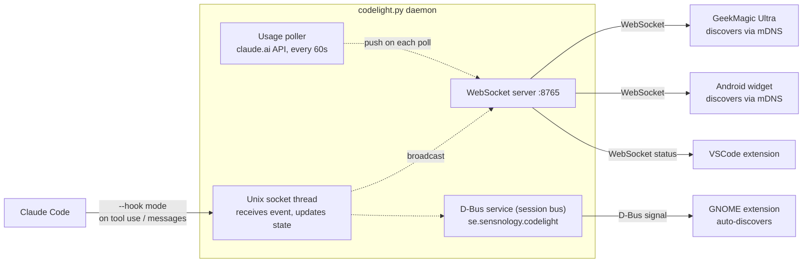

# codelight companion

The Python daemon `codelight.py` runs on your computer and pushes Claude Code
status to all connected clients — the GeekMagic Ultra screen, Android widget,
and GNOME extension.

When run in a terminal it shows a live dashboard. When run as a systemd service
it is silent (key events are logged to the journal via stdout).

## Dependencies

**Arch Linux**
```bash
sudo pacman -S python-websockets python-zeroconf python-dbus-fast  # python-dbus-fast optional: GNOME extension
```

**Debian / Ubuntu**
```bash
pip install websockets zeroconf dbus-fast  # dbus-fast optional: GNOME extension
```

`websockets` and `zeroconf` are required. `dbus-fast` is optional — install it
to enable the D-Bus service that the GNOME extension subscribes to.

## Run

```bash
python3 companion/codelight.py --name henrik-laptop
```

`--name` is required. It is the mDNS service instance name clients use to find
this daemon on the network. Use something unique per machine (e.g.
`henrik-laptop`, `alice-workstation`).

**With a shared secret** (recommended on shared networks):
```bash
python3 companion/codelight.py --name henrik-laptop --secret mypassword
```

Set the same secret in the screen's config page and in the Android app.
The GNOME extension uses D-Bus (session bus) and does not need a secret.

On first run the script automatically installs Claude Code hooks in
`~/.claude/settings.json` so it can track working/waiting state in real time.

Use `--verbose` (`-v`) to add low-level debug events (per-hook socket events,
raw API responses) to the activity log.

## Run as a systemd user service

The `--install` flag writes the unit file and enables the service in one step:

```bash
python3 companion/codelight.py --install --name henrik-laptop
python3 companion/codelight.py --install --name henrik-laptop --secret mypassword
```

```bash
systemctl --user status codelight   # verify it's running
```

The service is scoped to your graphical session — it starts automatically when you log into GNOME and stops cleanly on logout, which ensures it always connects to the correct D-Bus session bus.

Useful commands:

```bash
journalctl --user -fu codelight     # live logs
systemctl --user restart codelight  # restart after config change
systemctl --user disable --now codelight  # disable
```

## Remote permission approval

With `--remote-permissions` the companion takes over Claude Code's permission
prompts: the request is pushed to connected clients — the **Android app** and
the **GNOME extension** — and whoever answers first decides. Works for both the
`claude` CLI and the Claude Code VSCode plugin, which share the same hook
configuration. (In the VSCode window itself you just answer Claude Code's own
native dialog; the codelight VSCode extension only shows status. Remote
approval is for when you're away from the computer.)

```bash
python3 companion/codelight.py --install --name henrik-laptop \
    --secret mypassword --remote-permissions --vscode
```

- `--remote-permissions` **requires `--secret`** — an approval is code-execution
  capability and must not be open to anyone on the LAN. Only authenticated
  clients that explicitly subscribe receive permission requests; the ESP8266
  screen and older apps never see them.
- `--vscode` (with `--install`) installs the codelight VSCode status-bar
  extension — from a locally built `.vsix` if you have a repo checkout,
  otherwise downloaded from the latest GitHub release — and writes
  `codelight.secret` into your VSCode user settings automatically. VSCode picks
  the setting up live: no restart needed. `--uninstall` removes the extension
  and its settings again.
- If nobody answers within `--permission-timeout` seconds (default 60), Claude
  Code falls back to its normal built-in prompt — you lose nothing by having
  the feature on. Answering the built-in dialog also dismisses the remote
  prompts.
- Toggle prompts per client: the Android app's *Permission prompts* checkbox
  and the GNOME extension's preferences switch (both default on).

Under the hood this uses Claude Code's `PermissionRequest` hook, which fires
only when an interactive prompt would appear — normal auto-allowed tool calls
are unaffected. Headless `claude -p` runs never trigger it.

## Multiple companions on the same network

Each person runs their own daemon with a distinct `--name`:

```bash
# Henrik's laptop
python3 codelight.py --name henrik-laptop

# Alice's laptop
python3 codelight.py --name alice-laptop
```

Clients (screen, Android) are configured with the companion name of the person
they belong to and ignore the others. See the screen's config page for the
**Companion name** field.

## Firewall

The daemon needs two ports reachable from clients on your network:

| Port | Protocol | Purpose |
|------|----------|---------|
| 5353 | UDP | mDNS — lets clients discover the daemon automatically |
| 8765 | TCP | WebSocket — the actual data connection |

**ufw:**
```bash
sudo ufw allow 8765/tcp comment "codelight WebSocket"
sudo ufw allow 5353/udp comment "codelight mDNS"
```

**firewalld:**
```bash
sudo firewall-cmd --add-port=8765/tcp --permanent
sudo firewall-cmd --add-port=5353/udp --permanent
sudo firewall-cmd --reload
```

The GNOME extension communicates via D-Bus (session bus) — no firewall rules
needed for that.

## Uninstalling

```bash
python3 companion/codelight.py --uninstall
```

This removes all codelight entries from `~/.claude/settings.json`, deletes
`~/.claude/codelight.sock` and `~/.claude/monitor_state/`, and if the systemd
service is installed it stops, disables, and removes it.

> **Stop the daemon before uninstalling.** If it is still running it will
> re-install the hooks on its next startup.

## How it works



Status updates reach clients the moment a Claude Code hook fires — there is no
polling delay on the client side.

### Status detection — hooks

Claude Code hooks are shell commands invoked at specific points during a session.
On first run, `codelight.py` registers entries in `~/.claude/settings.json` for
events such as `PreToolUse`, `PostToolUse`, `PermissionRequest`, and `SessionEnd`.
When an event fires, Claude Code runs:

```
python3 codelight.py --hook working
```

with session metadata on stdin. The hook mode connects to a Unix socket at
`~/.claude/codelight.sock`, sends a one-line JSON event, and exits in ~1 ms.
The daemon's socket thread receives the event, updates its in-memory session
state, and immediately broadcasts to all connected clients. If the daemon is not
running the hook falls back to writing a state file so no errors appear in the
terminal.

### Usage data — claude.ai API

Every 60 seconds the usage thread fetches `https://claude.ai/api/oauth/usage`
using the OAuth access token from `~/.claude/.credentials.json` — the same
credential Claude Code itself uses, so no extra authentication is needed. The
response contains:

- `five_hour.utilization` — current 5-hour session window (0–100 %)
- `seven_day.utilization` — rolling 7-day total (0–100 %)
- `resets_at` — ISO-8601 timestamp for each window reset

Values are cached so clients always show something even when the API is
temporarily unreachable.
