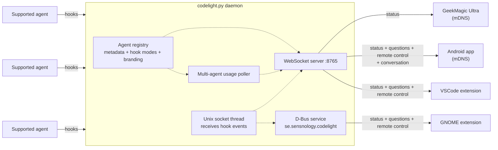
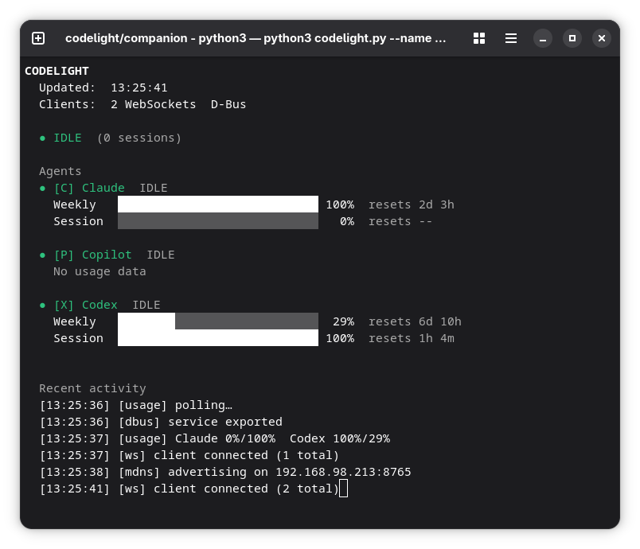

# codelight companion

The Python daemon `codelight.py` runs on your computer and pushes coding-agent
status to all connected clients — the GeekMagic Ultra screen, Android app,
GNOME extension, and VSCode extension. It detects supported agent integrations,
installs their hooks, and normalizes their status/usage/prompt events into one
client protocol. With `--remote-control` it also brokers supported interactive
prompts to those clients so you can approve permissions and answer questions
remotely (see [Remote control](#remote-control)).

When run in a terminal it shows a live dashboard. When run as a systemd service
it is silent (key events are logged to the journal via stdout).

## Dependencies

**Arch Linux**
```bash
sudo pacman -S python-websockets python-zeroconf python-dbus-fast  # python-dbus-fast optional: GNOME extension
```

**Debian / Ubuntu**
```bash
pip install websockets zeroconf dbus-fast  # dbus-fast optional: GNOME extension
```

`websockets` and `zeroconf` are required. `dbus-fast` is optional — install it
to enable the D-Bus service that the GNOME extension subscribes to.

## Run

```bash
python3 companion/codelight.py --name my-laptop
```

`--name` is required. It is the mDNS service instance name clients use to find
this daemon on the network. Use something unique per machine (e.g.
`henrik-laptop`, `alice-workstation`).

**With a shared secret** (recommended on shared networks):
```bash
python3 companion/codelight.py --name my-laptop --secret mypassword
```

Set the same secret in the screen's config page and in the Android app.
The GNOME extension uses D-Bus (session bus) and does not need a secret.

On startup the script detects supported agents from installed CLIs and VSCode
extensions, then manages hooks for every detected integration. The public daemon
path is agent-neutral: each integration contributes its own detection metadata,
hook installer, usage fetcher, transcript extractor, remote-control hook modes,
and client branding. Supported built-in integrations and their quirks are
documented in [AGENTS.md](AGENTS.md).

Use `--verbose` (`-v`) to add low-level debug events (per-hook socket events,
raw API responses) to the activity log.

### Agent configuration

Agent-specific options live in:

```text
~/.config/codelight/config.json
```

The file is optional. Missing keys use each integration's defaults. The shape is:

```json
{
  "agents": {
    "agent-id": {}
  }
}
```

See [AGENTS.md](AGENTS.md) for the current built-in agent IDs, supported keys,
usage sources, hook locations, and remote-control quirks.

Some integrations expose extra usage sources or credential options. Full
details live in [AGENTS.md](AGENTS.md). Editors that understand JSON Schema can
use [config.schema.json](config.schema.json) for validation/completion.

## Run as a systemd user service

The `--install` flag writes the unit file and enables the service in one step:

```bash
python3 companion/codelight.py --install --name my-laptop
python3 companion/codelight.py --install --name my-laptop --secret mypassword
python3 companion/codelight.py --install --name my-laptop \
  --secret mypassword --remote-control
```

No per-agent install flags are needed. The detected agent set is stored in the
service command so each daemon restart keeps those hooks current.

```bash
systemctl --user status codelight   # verify it's running
```

The service is scoped to your graphical session — it starts automatically when you log into GNOME and stops cleanly on logout, which ensures it always connects to the correct D-Bus session bus.

Useful commands:

```bash
journalctl --user -fu codelight     # live logs
systemctl --user restart codelight  # restart after config change
systemctl --user disable --now codelight  # disable
```

## Remote control

With `--remote-control` the companion takes over supported interactive prompts
and pushes them to connected clients, where whoever answers first decides. Two
kinds of prompt are handled:

- **Permission prompts** (Allow / Deny / persistent policy choices) — answer
  from the **Android app**, **GNOME extension**, or **VSCode**.
- **Agent questions** (multiple-choice + free-text) — answer
  from the **Android app**, the **GNOME extension**, or **VSCode** (a themed
  WebView in the editor).

Works across integrations that expose compatible permission/question hook
modes. Whoever answers first wins; a local fallback remains available when the
native agent prompt is preferred. The exact hook names and fallback semantics
are agent-specific; see [AGENTS.md](AGENTS.md#remote-control-quirks).

```bash
python3 companion/codelight.py --install --name my-laptop \
    --secret mypassword --remote-control --vscode
```

- `--remote-control` **requires `--secret`** — answering a prompt is
  code-execution capability and must not be open to anyone on the LAN. Only
  authenticated clients that explicitly subscribe receive the prompts.
- `--vscode` (with `--install`) installs the codelight VSCode extension — from a
  locally built `.vsix` if you have a repo checkout, otherwise downloaded from
  the latest GitHub release — and writes `codelight.secret` into your VSCode
  user settings automatically. VSCode picks the setting up live: no restart
  needed. `--uninstall` removes the extension and its settings again.
- If no capable client is connected, the prompt falls through to the native
  agent UI quickly — you're never stuck waiting on a device that isn't there. A
  briefly reconnecting client (e.g. VSCode restarting) is not mistaken for
  "nobody home". Otherwise, if nobody answers within `--permission-timeout`
  seconds (default 60), it also falls back. Answering the built-in dialog
  dismisses the remote prompts.
- Toggle prompts per client: the Android app's *Permission prompts* /
  *Question prompts* checkboxes, the GNOME extension's preferences switches, and
  the VSCode `codelight.questionPrompts` setting (all default on).

Normal auto-allowed tool calls are unaffected. Agent modules declare their
remote-control hook modes in the integration registry so the common hook path
can forward requests without clients knowing which agent produced them.

### Persistent folder and command approvals

A permission prompt can be approved once, or persisted in two deliberately
narrow forms:

- **Allow + Trust Folder for Safe Edits** trusts the repository root for
  read-only workspace tools and `apply_patch` additions/updates whose targets
  stay inside that root. Deletes and arbitrary shell commands still prompt.
- **Allow + Always Allow Exact Command Here** stores the complete command
  literally and only auto-allows that exact string inside the same repository.
  There are no prefixes, globs, regexes, or shell rewriting.

These rules apply consistently across supported agents because enforcement
happens in the common codelight hook path. They live in:

```text
~/.config/codelight/policy.json
```

Edit that file to review or revoke rules. Codelight does not read or modify VS
Code workspace-trust settings; its execution policy is intentionally separate.
The policy file is removed by `--uninstall`.

## Multiple companions on the same network

Each person runs their own daemon with a distinct `--name`:

```bash
# Henrik's laptop
python3 codelight.py --name henrik-laptop

# Alice's laptop
python3 codelight.py --name alice-laptop
```

Clients (screen, Android) are configured with the companion name of the person
they belong to and ignore the others. See the screen's config page for the
**Companion name** field.

## Firewall

The daemon needs two ports reachable from clients on your network:

| Port | Protocol | Purpose |
|------|----------|---------|
| 5353 | UDP | mDNS — lets clients discover the daemon automatically |
| 8765 | TCP | WebSocket — the actual data connection |

**ufw:**
```bash
sudo ufw allow 8765/tcp comment "codelight WebSocket"
sudo ufw allow 5353/udp comment "codelight mDNS"
```

**firewalld:**
```bash
sudo firewall-cmd --add-port=8765/tcp --permanent
sudo firewall-cmd --add-port=5353/udp --permanent
sudo firewall-cmd --reload
```

The GNOME extension communicates via D-Bus (session bus) — no firewall rules
needed for that.

## Uninstalling

```bash
python3 companion/codelight.py --uninstall
```

This removes every codelight-owned hook/file declared by the registered
integrations, even if an agent is no longer installed. It also deletes
`~/.config/codelight/codelight.sock`, `~/.config/codelight/monitor_state/`,
the shared policy file, and the systemd service.

> **Stop the daemon before uninstalling.** If it is still running it will
> re-install the hooks on its next startup.

## How it works



Status updates reach clients the moment an enabled agent hook fires — there is no
polling delay on the client side.

### Status detection and conversation following

Status detection is now agent-agnostic and driven by the integration registry.
At startup, codelight builds an `AgentRegistry`, detects installed integrations
from each agent's CLI/VSCode metadata, then installs hooks for each enabled
integration. Each agent module contributes its own hook installer and removable
files; the daemon does not need per-agent branches for hook installation.
Built-in modules are discovered automatically from `codelight_core/agents/`.

Each hook invokes codelight in hook mode and sends one normalized event over the
Unix socket at `~/.config/codelight/codelight.sock`. The daemon updates per-session
state tagged with `agent_id`, computes per-agent and overall status, and broadcasts
the snapshot to WebSocket and D-Bus clients immediately. If the daemon is not
available, hooks fall back to monitor-state files under
`~/.config/codelight/monitor_state`.

Conversation following uses transcript extractors registered by each
integration. Agent-specific JSONL/event formats are normalized into the same
read-only `user`/`assistant`/`tool`/`output` feed so clients do not need
agent-specific parsing. The feed is observational only and never injects
messages into a running agent session.

### Usage data — multi-agent poller

Every 60 seconds, one usage poll cycle runs across all registered agent
integrations. Each integration provides its own usage fetcher and data mapping,
so failures in one source do not block others.

Each integration decides whether it has usage data and how to map it into
client-facing limits. Built-in usage sources, credentials, and caveats are
listed in [AGENTS.md](AGENTS.md).

The daemon stores usage per agent and publishes a unified `per_agent_usage` model
to all clients. Each client renders whatever limits an integration exposes with
consistent labels and agent branding delivered in the connection handshake.
Agents may also expose usage actions. Codex currently exposes earned session
rate-limit resets through `rateLimitResetCredits` when `codex app-server`
account APIs are available; clients request a reset through the companion, which
consumes one reset credit and then refreshes `account/rateLimits/read`.

Configuration for usage credentials and agent homes lives in
`~/.config/codelight/config.json`; see `companion/AGENTS.md` for all supported keys.

When adding a new branded integration, generate the ESP8266 bitmap logo with:

```bash
python3 companion/tools/logo_bitmap.py path/to/logo.svg
```


