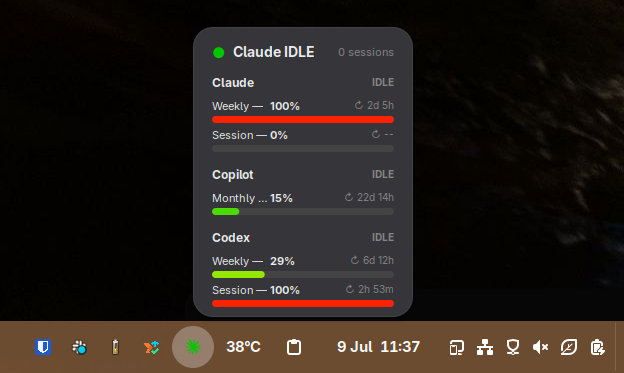

# codelight — GNOME Shell extension

A GNOME Shell extension that shows the active supported-agent status in the top
bar. Agent names, colors, and logos are delivered by the companion.



The panel indicator shows the active agent plus **WORKING**, **WAITING**, or
**IDLE**. Click it to see usage grouped by agent and the number of active
sessions. Agents without detailed usage permission still appear with status
only. The extension connects to the companion daemon via **D-Bus**.

When the companion runs with `--remote-control`, the same popup also lets you
answer agent prompts: **Allow / Deny** for a permission request, or the
options + an "Other…" free-text field for a supported question. Whoever answers
first (GNOME, the phone, or VSCode) wins. The exact native question tool is
agent-specific; the companion normalizes it before it reaches the extension.
Turn each kind on or off in the extension's preferences (*Permission prompts* /
*Question prompts*, both default on).

Permission prompts can also trust the repository for narrowly safe edits or
persist the exact command for that repository. Rules are enforced across all
agents by the companion; see
[Persistent folder and command approvals](../companion/README.md#persistent-folder-and-command-approvals).

Requires **GNOME 45 or later** and the companion daemon from
[companion/README.md](../companion/README.md) running on the same machine.

## Install

```bash
cd gnome-extension
bash install.sh
```

The script copies files to `~/.local/share/gnome-shell/extensions/codelight@sensnology.se/`,
compiles the GSettings schema, and enables the extension.

If the indicator doesn't appear after install:
- **X11** — press `Alt+F2`, type `r`, press Enter (restarts GNOME Shell in-place)
- **Wayland** — log out and log back in

## Manual install

```bash
UUID="codelight@sensnology.se"
DEST="$HOME/.local/share/gnome-shell/extensions/$UUID"

mkdir -p "$DEST/schemas" "$DEST/icons"
cp metadata.json extension.js prefs.js "$DEST/"
cp icons/*.svg "$DEST/icons/"
cp schemas/org.gnome.shell.extensions.codelight.gschema.xml "$DEST/schemas/"
glib-compile-schemas "$DEST/schemas/"
gnome-extensions enable "$UUID"
```

## How it works

The extension watches for the D-Bus name `se.sensnology.codelight` on the session bus.
When `codelight.py` starts, the extension automatically connects, fetches the current
status, and subscribes to live `StatusChanged` signals (plus permission/question request
signals when remote control is enabled). It also periodically *announces* itself to the
daemon, so the daemon knows a desktop client is present and doesn't fall a question
through to the local dialog while GNOME is available to answer it. When the daemon stops,
the indicator shows **OFFLINE**.

No host, port, or secret settings are needed — the session bus is user-private and only
reachable by processes running as the same user.

## Start the daemon

```bash
python3 companion/codelight.py --name my-laptop
```

See [companion/README.md](../companion/README.md) for running as a systemd service.

## Reload after changes

```bash
bash gnome-extension/install.sh
```

## Uninstall

```bash
gnome-extensions disable codelight@sensnology.se
rm -rf "$HOME/.local/share/gnome-shell/extensions/codelight@sensnology.se"
```
