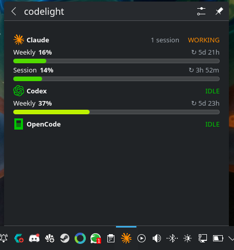
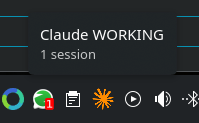
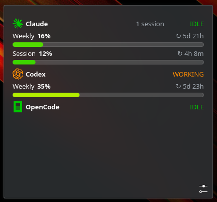
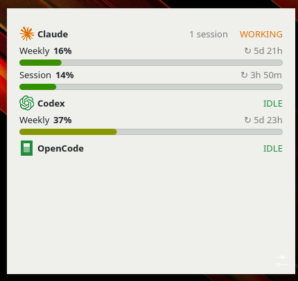
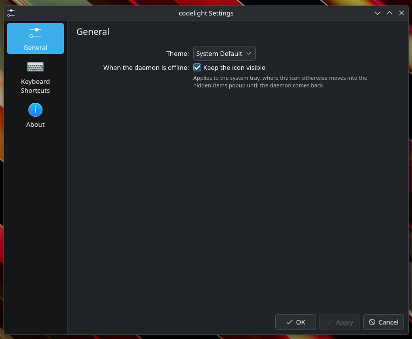

# codelight — KDE Plasma applet

A KDE Plasma 6 widget that shows the active supported-agent status and usage for
[codelight](../README.md). Agent names, colors, and logos are delivered by the
companion daemon. One Plasma applet package provides **both** a panel/system-tray
icon with a popup **and** a resizable desktop widget — place it wherever you like.



The panel/tray icon shows the active agent's logo tinted with its status
(**WORKING** orange, **WAITING** red, **IDLE** green, offline grey); hovering
shows a live tooltip with agent, status, and session count. Click it to open a
popup with usage grouped by agent. Agents without a usage meter still appear
with status only, and the widget renders whatever usage limits the daemon
exposes per agent (zero, one, or two windows) — windows that disappear as
plans change vanish from the UI without showing 0%.

Each usage row shows the window's label, the percentage used, a reset countdown
(`↻ 5d 23h`), and a bar whose color runs green → yellow → orange → red as the
window fills, matching the screen firmware and the Android and GNOME clients.

This applet is **status and usage only** — it does not answer permission or
question prompts. See [Scope](#scope-this-version).

<table>
<tr>
<td></td>
<td></td>
<td></td>
</tr>
<tr>
<td align="center">Tray icon tooltip</td>
<td align="center">Desktop widget</td>
<td align="center">Light color scheme</td>
</tr>
</table>

## Requires

- **KDE Plasma 6.2 or later.** The applet uses the
  `org.kde.plasma.workspace.dbus` QML module from `plasma-workspace`, which
  first shipped in Plasma 6.2. Plasma 5 is not supported at all (the applet uses
  the Plasma 6 `PlasmoidItem` API). Live push updates use that module's
  `SignalWatcher`, added in Plasma 6.4; on 6.2 and 6.3 the applet detects its
  absence and polls the daemon every 2 s instead — the same rate the daemon
  recomputes status at.
- `kpackagetool6`, used by the install script. It ships with KF6's kpackage
  (Arch: `kpackage`, Debian/Ubuntu: `libkf6package-bin`, Fedora: `kf6-kpackage`)
  and is present on any standard Plasma 6 install.
- The [companion daemon](../companion/README.md) running on the same machine,
  with `dbus-fast` installed so it exports the D-Bus service.

Known-good distro versions: Fedora 41 (6.2), Debian 13 and Kubuntu 25.04 (6.3,
polling path), Kubuntu 25.10 and Fedora 43 (6.4), Kubuntu 26.04 LTS, KDE neon,
Arch, and openSUSE Tumbleweed (6.6+). Ubuntu/Kubuntu 22.04 and 24.04 LTS ship
Plasma 5 and cannot run this.

The applet talks to the companion over **D-Bus on the session bus** — no host,
port, or secret needed. The session bus is user-private; only processes
running as the same user can reach it.

## Install

```bash
cd kde-plasma
bash install.sh
```

The script installs the applet package to
`~/.local/share/plasma/plasmoids/se.sensnology.codelight/` with `kpackagetool6`,
and the `codelight` theme icon to
`~/.local/share/icons/hicolor/scalable/apps/codelight.svg` (a Plasma/Applet
package cannot ship a theme icon itself). It then refreshes the icon and
service caches when `gtk-update-icon-cache` and `kbuildsycoca6` are available.
Re-running it upgrades an existing install.

`plasmashell` caches both QML and the icon theme, so restart the shell if the
widget or its icon doesn't show up:

```bash
systemctl --user restart plasma-plasmashell.service
```

## Manual install

```bash
kpackagetool6 --type Plasma/Applet --install package   # or --upgrade package
install -Dm644 icons/codelight.svg \
  "$HOME/.local/share/icons/hicolor/scalable/apps/codelight.svg"
kbuildsycoca6
```

## Add it

Open **Edit Mode** → **Add Widgets** and search **codelight**:

- **Panel / tray icon:** drag it onto the panel (near the system tray) — it
  becomes a compact status icon that opens a popup on click.
- **Desktop widget:** drag it onto the desktop — it becomes a resizable widget
  showing the full agent list.

To test in a standalone window first:

```bash
plasmawindowed se.sensnology.codelight
```

## How it works

The applet watches for the D-Bus name `se.sensnology.codelight` on the session
bus. When the daemon appears it fetches the client config (`GetConfig("kde")`,
which carries agent branding + SVG logos) and the current status
(`GetStatus()`), then subscribes to live `StatusChanged` signals — falling back
to polling on Plasma 6.2/6.3, see [Requires](#requires). When the daemon stops
it shows an offline state and reconnects automatically on the next appearance —
no reload needed. Only agents the daemon reports as seen
(`per_agent_status` / `per_agent_usage`) are shown, matching the GNOME and
Android clients.

The package deliberately does **not** set `X-Plasma-DBusActivationService`.
That key makes the system tray load the applet only while the named service is
on the bus and unload it when the service goes away — which would make the
offline state and the *Keep the icon visible* option unreachable in the tray,
the placement they exist for.

## Configuration



Right-click the widget → **Configure codelight…**. There is also a ⚙ button in
the widget's bottom-right corner on the desktop and in a `plasmawindowed`
window; in the system tray the tray's own popup header provides the gear
instead, so the widget hides its own.

- **Theme** — palette for the widget: **System Default** (follows your Plasma
  color scheme, including custom and accessibility schemes, and keeps the
  popup's translucent Breeze background), **Light**, **Dark**, or
  **High Contrast**. The explicit choices apply codelight's own fixed palette.
  Status and usage-bar colors stay branded in every mode.
- **Keep the icon visible when the daemon is offline** (default on) — applies to
  the **system tray**. When unchecked, the icon moves into the tray's
  hidden-items popup while the daemon is down and returns when it reappears.
  Widgets on the desktop or placed directly on a panel are always visible.

Plasma stores widget configuration **per instance**, so a tray icon and a
desktop widget each keep their own Theme setting.

On the desktop, Plasma's own **Show background** checkbox (in the widget's
settings) works as usual — untick it for a chrome-free widget floating on the
wallpaper. On **System Default** the widget is already transparent and simply
inherits the standard Plasma background; the Light/Dark/High Contrast modes
paint codelight's own solid backdrop instead, and unticking the box drops that
too. A panel or tray popup always gets the shell's dialog background.

## Start the daemon

```bash
python3 companion/codelight.py --name my-laptop
```

See [companion/README.md](../companion/README.md) for running as a systemd
service and all options.

## Reload after changes

```bash
bash kde-plasma/install.sh
systemctl --user restart plasma-plasmashell.service
```

Re-running the script upgrades the installed package, but `plasmashell` keeps
the old QML in memory until it restarts. For tight iteration,
`plasmawindowed se.sensnology.codelight` reloads from disk on each launch and
prints QML errors to the terminal.

## Uninstall

```bash
bash kde-plasma/install.sh remove
```

Or, without the repo checked out:

```bash
kpackagetool6 --type Plasma/Applet --remove se.sensnology.codelight
rm -f "$HOME/.local/share/icons/hicolor/scalable/apps/codelight.svg"
```

Remove the widget from your panel and desktop first. Uninstalling does not
delete its stored settings, which live in
`~/.config/plasma-org.kde.plasma.desktop-appletsrc`.

## Troubleshooting

**The widget says "codelight daemon offline" but the daemon is running.**
The daemon only claims the D-Bus name when the `dbus-fast` Python package is
installed; without it, it runs WebSocket-only. Check:

```bash
busctl --user list | grep se.sensnology.codelight
busctl --user call se.sensnology.codelight /se/sensnology/codelight \
  se.sensnology.codelight GetStatus
```

**The widget is blank, or doesn't appear in Add Widgets.**
Run `plasmawindowed se.sensnology.codelight` from a terminal — QML errors go to
stderr. The applet also logs its own D-Bus failures with a `[codelight]` prefix:

```bash
journalctl --user -b -t plasmashell | grep codelight
```

If it's missing from Add Widgets entirely, your Plasma is likely older than 6.2
(check with `plasmashell --version`), or the shell hasn't picked up the new
theme icon yet — restart `plasma-plasmashell.service`.

**The tray icon vanishes when the daemon stops.** That's the *Keep the icon
visible when the daemon is offline* setting; see [Configuration](#configuration).

## Scope (this version)

Status + usage display only. Deferred:

- **Remote permission/question prompts** — requires generalizing the
  companion's GNOME-specific presence bookkeeping (a single-slot `Announce`
  heartbeat) before a second desktop client can call it safely.
- **Hiding specific installed ("seen") agents** — planned as a companion-side
  feature (global default + per-caller override); tracked separately.
